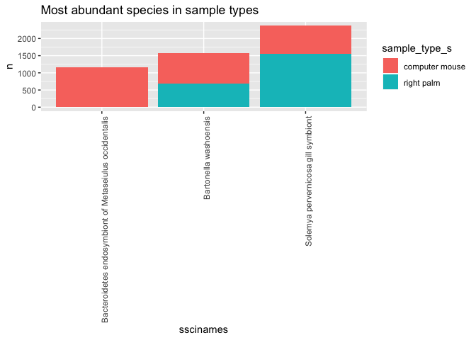
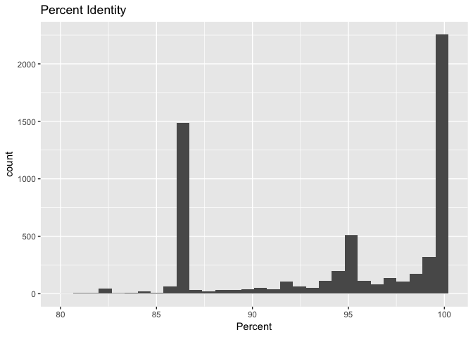

Analysis of BLAST Results
================
Brian Rezende
October 8, 2018

Introduction
============

Advancements and implementation of sequencing caters to range of scientific questions that are in question. For instance, pyrosequencing is a method of DNA sequencing that relies on the detection of pyrophosphate release and generation of light on nucleotide incorporation. [Source](https://www.sciencedirect.com/topics/neuroscience/pyrosequencing) This particular type of sequencing has been beneficial in being able to quantitatively compare bacterial commmunities across various subjects. In scientific literature there has been an influx of research that highlights the diversity of skin-associated bacteria, which was once thought of as less diverse. This work has also demonstrated that there is high interindividual variability in the composition of these communities. Through using this approach we are better able to investigate communities that were once indistinguishable to us.

Have you ever pondered on the number of individuals that pass through and use an institutes library a day? Quickly these spaces may turn into breeding grounds for bacteria and other microbial organisms. Though they remain invisible to the human eye, there is no denying their existence and ability to grow and spread exponentially. Fortunately, advancements in the field of sequencing have allowed for analysis of urban biomes. In this analysis we'll examine diverse skin-associated bacterial communities and their comparison to human bacterial communities. Findings centered around these communities have found that skin bacterial communities are personalized, yet there is a link between the residual skin bacteria left on objects and bacteria on the object that the individual last touched. This **revolutionary forensic practice** predicts and can even match the bacteria on objects that have been left untouched for up to two weeks. The bacteria range in place of origin and allow us to better understand the mechanisms of bacteria, the degree of variability, and to one day become integrated with *traditional* forensic practices.

Methods
=======

Sample origin and sequencing
----------------------------

Fierer et. al provided the inital samples that promoted this analysis. They swabbed the palms of men and woman and computer mice at the University of Colorado, Boulder. By following a persistent trend that skin-associated bacteria leaves on objects and surfaces touched on a daily basis, they discovered abundant and diverse bacterial communities. The following criteria was required to properly link the bacteria from different environments: *Recovered bacterial DNA allows for adequate characterization and comparison of communities. *Persistance of skin-associated bacteria on surfaces for days to weeks \*Surfaces touched are effectively linked to individuals by assessing the similarity between the two bacterial communities. This was completed by carrying out three interrelated studies, which combined phylogenetic community analyses with a high throughput pyrosequencing approach.

Add about a paragraph here.

Computational
-------------

To initiate the project 20 raw fastq files were run through a pipeline that performed quality control checks. Information within these fastq files were from cultured swabs that originated from individual keys from three keyboards. These keyboard communities were then compared to the communities found on the fingertips of the respective keyboard user. These communities included the right palms of 5 human men, 5 human females, and 10 computer mice. The files were trimmed based on quality score and then converted to fasta files through the use of for loops. These files were then BLAST'ed against a local repository on GenBank to produce BLAST sequence code. By BLAST'ing a sample, it is being run against the database and looking for sequence matches. Following this pipeline, the fasta files were analyzed further by running the CSV files into an alternate pipeline. This allowed for greater specification in what the files contained and what we may infer from them.

Once the BLAST sequence code was complete the output was marked down with R. The pyrosequencing technique aforementioned was used, thus generating an average of 1,4000 bacterial 16S rRNA gene sequences per sample. The BLAST results were transformed into figures rather than quantifiable data for further analysis. What this aims to answer is the validity of being able to quantitatively compare bacterial communities found on objects and skin to effectively match the individual to the object with a high degree of certainty.[Source](https://trace.ncbi.nlm.nih.gov/Traces/sra/sra.cgi?study=ERP022657) The final step included using another Genbank database with over 250 hand surfaces and matching the objects to specific individuals by the bacteria that was collected.

The cultured swabs originated from individual keys from three keyboards. These keyboard communities were then compared to the communities found on the fingertips of the respective keyboard user. In order to further support their samples they obtained swabs from private and public computer keyboards to quantify the degree of correspondance between the owners "fingerprints" and their keyboard versus keyboards they have never used. Using the skin bacteria communities they examined how similar they were with objects stored at **-20ºC**. [Source](https://www.ncbi.nlm.nih.gov/bioproject/PRJEB20500/) This comparison is made due to the conditions closely matching ones that are imposed on stored samples before undergoing DNA extraction. The final step included using a Genbank database with over 250 hand surfaces and matching the objects to specific individuals by the bacteria that was collected.

And another paragraph or two here.

Results
=======

``` r
# Be sure to install these packages before running this script
# They can be installed either with the install.packages() function
# or with the 'Packages' pane in RStudio

# load packages
library("dplyr")
library("tidyr")
library("knitr")
library("ggplot2")
```

``` r
# Output format from BLAST is as detailed on:
# https://www.ncbi.nlm.nih.gov/books/NBK279675/
# In this case, we used: '10 sscinames std'
# 10 means csv format
# sscinames means unique Subject Scientific Name(s), separated by a ';'
# std means the standard set of result columns, which are:
# 'qseqid sseqid pident length mismatch
# gapopen qstart qend sstart send evalue bitscore',


# this function takes as input a quoted path to a BLAST result file
# and produces as output a dataframe with proper column headers
# and the 'qseqid' column split into sample and seq number
read_blast_output <- function(filename) {
  data_in <- read.csv(filename,
                      header = FALSE, # files don't have column names in them
                      col.names = c("sscinames", # unique Subject Sci Name(s)
                                    "qseqid",    # Query Seq-id
                                    "sseqid",    # Subject Seq-id
                                    "pident",    # Percntge of identical matches
                                    "length",    # Alignment length
                                    "mismatch",  # Number of mismatches
                                    "gapopen",   # Number of gap openings
                                    "qstart",    # Start of alignment in query
                                    "qend",      # End of alignment in query
                                    "sstart",    # Start of alignment in subj
                                    "send",      # End of alignment in subject
                                    "evalue",    # Expect value
                                    "bitscore"))  # Bit score

  # Next we want to split the query sequence ID into
  # Sample and Number components so we can group by sample
  # They originally look like "ERR1942280.1"
  # and we want to split that into two columns: "ERR1942280" and "1"
  # we can use the separate() function from the tidyr library to do this
  # Note that we have to double escape the period for this to work
  # the syntax is
  # separate(column_to_separate,
  # c("New_column_name_1", "New_column_name_2"),
  # "seperator")
  data_in <- data_in %>%
    separate(qseqid, c("sample_name", "sample_number"), "\\.")
}
```

``` r
# this makes a vector of all the BLAST output file names, including
# the name(s) of the directories they are in
files_to_read_in <- list.files(path = "output/blast",
                               full.names = TRUE)

# We need to create an empty matrix with the right number of columns
# so that we can rbind() each dataset on to it
joined_blast_data <- matrix(nrow = 0,
                            ncol = 14)

# now we loop over each of the files in the list and append them
# to the bottom of the 'joined_blast_data' object
# we do this with the rbind() function and the function we
# made earlier to read in the files, read_blast_output()
for (filename in files_to_read_in) {
  joined_blast_data <- rbind(joined_blast_data,
                             read_blast_output(filename))
}
```

``` r
# Next we want to read in the metadata file so we can add that in too
# This is not a csv file, so we have to use a slightly different syntax
# here the `sep = "\t"` tells the function that the data are tab-delimited
# and the `stringsAsFactors = FALSE` tells it not to assume that things are
# categorical variables
metadata_in <- read.table(paste0("data/metadata/",
                                 "fierer_forensic_hand_mouse_SraRunTable.txt"),
                          sep = "\t",
                          header = TRUE,
                          stringsAsFactors = FALSE)

# Finally we use the left_join() function from dplyr to merge or 'join' the
# combined data and metadata into one big table, so it's easier to work with
# in R the `by = c("Run_s" = "sample_name")` syntax tells R which columns
# to match up when joining the datasets together
joined_blast_data_metadata <- metadata_in %>%
  left_join(joined_blast_data,
            by = c("Run_s" = "sample_name"))
```

``` r
levels(factor(joined_blast_data_metadata$env_feature_s))
```

    ## [1] "human-associated habitat" "surface"

``` r
#group by species name and calculate mean percent identity
joined_blast_data_metadata %>%
  group_by(sscinames, sample_type_s) %>%
  tally() %>%
  filter(n > 475) %>%
  ggplot(aes(x = sscinames,
             y = n,
             fill = sample_type_s)) +
  geom_col()+
  labs(x = "Scientific names") +
  labs(y = "Number of species") +
  theme(axis.text.x = element_text(angle = 90,
                                   hjust = 1)) +
ggtitle("Most abundant species in sample types")
```



``` r
# grouping and summarizing to see how the types of taxa are similar on male/female
# hands and computer mice
joined_blast_data_metadata %>%
  group_by(sample_type_s, sex_s, sscinames) %>%
  tally() %>%
  filter(n > 220) %>%
  ggplot(aes(x = sample_type_s,
             y = n,
             fill = sscinames)) +
    geom_col(position = position_dodge()) +
    facet_wrap(~sex_s) +
    theme(axis.text.x = element_text(angle = 60,
                                     hjust = 1)) + 
  labs(x = "Sample type") +
  labs(y = "Number of species" ) +
ggtitle("Similarity of taxa in sample types")
```


``` r
#group and track the sequence alignment length and number of mismatches 
joined_blast_data_metadata %>%
  group_by(length, mismatch) %>%
  ggplot(aes(x = length,
             y = mismatch)) +
  geom_point() +
  labs(x = "Sequence length") +
  labs(y = "Number of Mismatches") +
ggtitle("Mismatches in sequence lengths")
```


``` r
# Here using the 
joined_blast_data_metadata %>%
  filter(bitscore < 200,
         bitscore > 180) %>%
  group_by(sscinames) %>%
  summarize(mean_bitscore = mean(bitscore)) %>%
  ggplot(aes(x = sscinames,
             y = mean_bitscore))+
  geom_col() +
  labs(x = "Scientific names") +
  labs(y = "Mean Bitscore") +
  theme(axis.text.x = element_text(angle = 90,
                                   hjust = 1)) +
  ggtitle("Bitscores")
```


``` r
joined_blast_data_metadata %>%
  filter(bitscore < 200,
         bitscore > 150) %>%
  select(sscinames) %>%
  distinct() %>%
  pull() -> low_bitscore
```

``` r
joined_blast_data_metadata %>%
  filter(sscinames %in% low_bitscore) %>%
  group_by(sscinames) %>%
  tally() %>%
  arrange(desc(n))
```

    ## # A tibble: 74 x 2
    ##    sscinames                                        n
    ##    <fct>                                        <int>
    ##  1 Solemya pervernicosa gill symbiont            2372
    ##  2 unidentified bacterium                         420
    ##  3 Cardiobacterium sp. feline oral taxon 346      101
    ##  4 Lupinus angustiflorus                           92
    ##  5 Alphaproteobacteria bacterium                   42
    ##  6 Anaeroplasma abactoclasticum                    35
    ##  7 bacterium endosymbiont of Onthophagus Taurus    35
    ##  8 Ruminococcus sp.                                33
    ##  9 Treubaria triappendiculata                      16
    ## 10 bacterium WH3-2                                 14
    ## # ... with 64 more rows

``` r
# Here we're using the dplyr piping syntax to select a subset of rows matching a
# criteria we specify (using the filter) function, and then pull out a column
# from the data to make a histogram.
joined_blast_data_metadata %>%
  filter(env_material_s == "sebum") %>%
  ggplot(aes(x = pident)) +
    geom_histogram() +
    ggtitle("Percent Identity") +
    xlab("Percent")
```

    ## `stat_bin()` using `bins = 30`. Pick better value with `binwidth`.



In Figure 1 this demonstrates the top four species that were found in both the computer mice and the right palm of both men and women. The number of times that a species name was recognized is tallyed and plotted against its repsective name and demonstrates the abundance. It shows that **Solemya pervernicosa gill symbiont** has the greatest abundance on human hands while **Bacterioidetes endosymbiont of Metaseiulus occidentalis** has the greatest abundance on only computer mice. An interesting finding that this figure reports is that although **Aquitalea sp.KJ011** was amongst one of the most abundant bacterial species, it appeared only on human palms. Figure 2. aimed to delve greater into the distribution of the species in each specific sample type. It becomes evident that there is discrimination in the types of species that exist on male and female hands, while sharing some similarity with the computer mice. The computer mice samples have a greater distribution of bacterial communities, while the human palm communities are more heavily populated 1-2 communities. **Bartonella washoensis** is shown to appear more *only* on the palms of females while **Solemya pervernicosa gill symbiont** appears more *only* on the palms of males. This graph is taking the top reported communities and cross examining them to see if a community thrives on more than one sample type. Figure 3. offers a *broader* perspective on the analysis made. It demonstrates that as the sequence lengths increase, there is a steady increase in the number of mismatches. The shorter the sequence length is the less mismatches that are reported. It groups and tracks the sequence alingment length and number of mismatches. Figure 4. compiles the names of species that obtained a Bitscore in the range of 180-200. A Bitscore is generated by BLAST and it demonstrates that there is a greater accuracy in being able to match the sequences of the collected species to the Genbank database that it was compared to. It reports those that had greater sequence similarity and plots them against one another.

Discussion
==========

Our initial analysis was run through a series of pipelines and parameters. The pipelines served as a method to infer specifics and clean up the data before running it through RStudio parameters. Beginning with Figure 1. that details the top four bacterial species found within the samples, it allows for more detailed analysis of the communities. This can be viewed as the foundation of the analysis because it demonstrates which community has the greatest prevalence on the samples. Solemya pervernicosa gill symbiont appeared on four of the five male subjects that were tested and sequenced, which correlates with their greater appereance on male subjects as opposed to female or computer mice subjects. This type of bacteria is interesting due to its origin being from northwestern Japan. Despite its vast travel length, it is found commonly in both male hand samples and computer mice. In contrast, there was a greater prevalence of *Bartonella washoensis* in both female hand samples and computer mice, which could be inferred from their source of mitral valve endocarditis. This bacteria was spread from dogs to squirrels and it was correlated to causing meningitis in humans. Despite the bacteria holding implications for viral infections, it is tamed and exists on communities in common sample types.

Morever, Figure 3 is especially interesting due to being able to track the number of mismatches within the sequence lengths. This leads us to believe that with better sequencing techniques we would be able to achieve a higher level of similarity within the species and sample types. A baseline exists towards the longer end of the sequences, which leads us to believe that there is an organism that did not register an appropriate number of sequences. Other organisms have a straight plot that demonstrates frequent mismatches as the sequence length increases. There is a greater density and spread as the sequence length increases, which could be reconclied by using more advanced sequencing methods.

In Figure 4. the distribution of Bitscores is interesting to examine due to its spread across several species. It is crucial to consider that the higher the Bitscore the greater the sequence similarity is. If there is a higher Bitscore then we are able to better trust of the sequence names and how it compares to the GenBank database. Once we're able to better match the species sequences to the GenBank database we can infer that the pipeline and BLAST sequencing is accuarate in reproducing data. Future implications that this holds is that through better sequencing techniques and an increased sample type we can better relate sample types and different bacteria that exist on them. If we are able to limit the number of mismatches and sequence length then there would be a greater accuracy of quantifying the type of communities that exist on humans, animals, and other objects.
